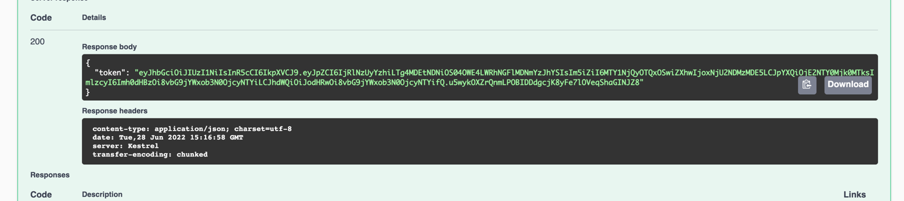

# SparkybitTest

## Note about Sparkybit.
Is scam company with stupid test tasks. Fuck it! Don't waste your time

**How build and start**

````
docker-compose build
docker-compose up -d
````

Api use 5001 port

### How to Login
Login `test` password `1234`

```
curl -X 'POST' \
  'http://localhost:5001/api/auth' \
  -H 'accept: */*' \
  -H 'Content-Type: application/json' \
  -d '{
  "login": "test",
  "password": "1234"
}'
```

in response you get bearer token


## How to add user

```
curl -X 'POST' \
  'http://localhost:5001/api/user' \
  -H 'accept: */*' \
  -H 'Authorization: Bearer {token}' \
  -H 'Content-Type: application/json' \
  -d '{
  "name": "MyName"
}'
```

## How get all users 

```
curl -X 'GET' \
  'http://localhost:5001/api/user' \
  -H 'accept: text/json' \
  -H 'Authorization: Bearer {token}'
```